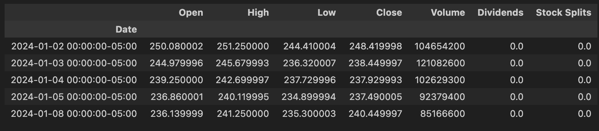
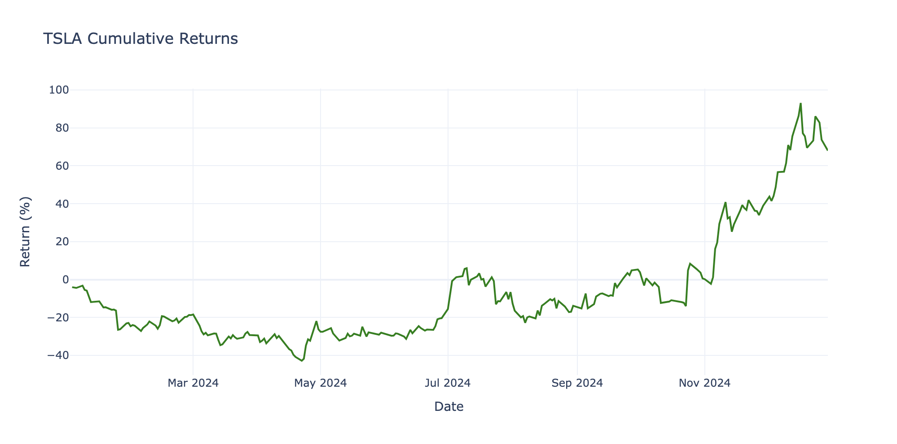

# 1. Introduction

`agentools` is a lightweight and flexible library designed for building smart agent assistants across various industries. Whether you're creating an AI-powered customer service bot, a data analysis assistant, or a domain-specific automation agent, agentools provides a simple yet powerful foundation.

With its modular tool system, you can easily extend your agent's capabilities by integrating a wide range of tools. Each tool is self-contained, well-documented, and can be registered dynamically—making it effortless to scale and adapt your agent to new tasks or environments.


To install and use this library please following:

```
git@github.com:datascienceworld-kan/agentools.git
cd agentools
pip install -r requirements.txt
poetry install
```

To use a list of default tools inside [agentools.tools](agentools/tools/) you should set environment varibles inside `.env`:

```
TOGETHER_API_KEY="Your together API key"
TAVILY_API_KEY="Your Tavily API key"
```

# 2. Set up Agent

`agentools` is a flexible library for creating intelligent agents. You can configure your agent with tools, each encapsulated in a Python module under `agentools.tools`. This provides a workspace of tools that agents can use to interact with and operate in the realistic world. Each tool is a Python file with full documentation and it can be independently ran. For example, the [agentools.tools.websearch_tools](agentools/tools/websearch_tools.py) module contains code for interacting with a search API.


```python
import os
import sys
from langchain_together import ChatTogether 
sys.path.append(os.path.join(os.getcwd(), "agentools"))
from agentools.agent.agent import Agent
from dotenv import load_dotenv
load_dotenv()

llm = ChatTogether(
    model="meta-llama/Llama-3.3-70B-Instruct-Turbo-Free"
)

# Step 1: Create Agent with tools
agent = Agent(
    llm = llm,
    tools = ['agentools.tools.yfinance_tools', 'agentools.tools.websearch_tools']
)

# Step 2: invoke the agent
df = agent.invoke("What is the price of Tesla stock in 2024?")
df.head()
```



```python
plot = agent.invoke("Let's visualize Tesla stock in 2024?")
```
  

    

```python
plot = agent.invoke("Let's visualize the return of Tesla stock in 2024?")
```
  

    

# 3. Register function tool

Function tools are registered directly in your runtime code by decorating them with the @function_tool without saving them into python module files.


```python
from agentools.register.tool import function_tool
from typing import List

@function_tool
def sum_of_series(x: List[float]):
    return f"Sum of list is {sum(x)}"
```


```python
agent.invoke("Sum of this list: [1, 2, 3, 4, 5, 6, 7, 8, 9, 10]?")
```
    'Sum of list is 55'

# 4. License
`agentools` is released under the MIT License. You are free to use, modify, and distribute the code for both commercial and non-commercial purposes.

# 5. Contributing
We welcome contributions from the community. If you would like to contribute, please read our [Contributing Guide](https://github.com/datascienceworld-kan/agentools/blob/main/CONTRIBUTING.md). If you have any questions or need help, feel free to join [Discord Channel](https://discord.com/channels/1036147288994758717/1358017320970358864).
