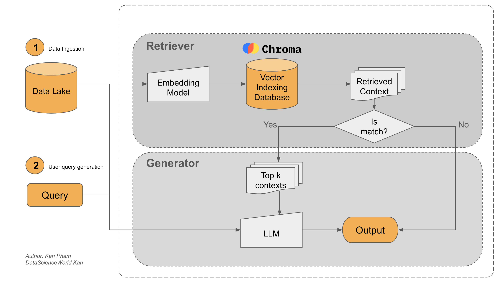

# Agent RAG
[](https://colab.research.google.com/github/datascienceworld-kan/vinagent-docs/blob/main/docs/tutorials/get_started/agent_rag.ipynb)

Let’s assume your company plans to build a smart assistant that can answer not only general questions but also specific ones related to your internal company documents. It is difficult for an LLM to answer such questions if it has not been studied on the topic beforehand.

The RAG (Retrieval-Augmented Generation) pipeline is an approach in natural language processing (NLP) that improves answer accuracy by retrieving relevant information before generating a response. It combines information retrieval with language generation techniques and serves as a solution to enhance the performance of generative models by incorporating a retriever component.

## Why is RAG pipeline

Certainly, RAG pipeline demonstrates its prowess of retrieving the relevant contexts from diverse data sources. It is a powerful tool that pushes the capability of a normal LLM to a new frontier. In a nushell, there are three principal advantages of using RAG such as:

- **Empowering LLM with real-time data access**:
Because the business context always constantly changes over time. Therefore, data is constantly dynamic and transformed in an enterprise that demands AI solutions, which can use LLMs to have the ability to remain up-to-date and current with RAG to facilitate direct access to additional data resources. Ideally, these resources should comprise of real-time and personalized data.

- **Preserving data privacy**:
Many enterprise data is sensitive and confidential. That is why the commercial LLM models like GPT-4, GPT-3.5, Claude, Grok, and Gemini are banned in several corporations, especially in the case where data is considered as the new gold. Therefore, ensuring data privacy is crucial for enterprises.To this end, with a self-hosted LLM (demonstrated in the RAG workflow), sensitive data can be retained on-premises just like the local stored data.

- **Mitigating LLM hallucinations**:
In fact since many LLMs lack access to factual and real-time information, they often generate inaccurate responses but seem convincing. This phenomenon, so-called hallucination, is mitigated by RAG, which reduces the likelihood of hallucinations by providing the LLM with relevant and factional information.

## RAG Architecture



A standard RAG comprises two major modules: `retriever` and `generator`.

**1. Retriever**

The retriever finds relevant information from a large collection of documents.

- Data ingestion: Data is collected from various sources like pdf files, text files, powerpoint slides, docs, emails, or websites.
- Document preprocessing: Long documents are split into smaller parts to make them easier to handle.
- Generating embeddings: Each part is turned into a numeric vector using an embedding model.
- Storing in vector databases: These vectors are saved in a special database for fast searching.

**2. Generator**

The generator uses a language model to create a response based on the retrieved information.

- LLMs: A large language model reads the user query and the retrieved text to write an answer.
- Querying: The system compares the user query with saved vectors to find matching text before generating a reply.


## Build RAG Agent


```python
%pip install --upgrade 'aucodb[vectordb]'
```

A standard blog [LLM-Powered AI Agent, Lilian Weng](https://lilianweng.github.io/posts/2023-06-23-agent/) is used as an example knowledge data source. We develop an RAG Agent, which use this blog, to answer many concepts of AI Agent.


```python
import bs4
from langchain.text_splitter import RecursiveCharacterTextSplitter, TextSplitter
from langchain.document_loaders import WebBaseLoader

# Load sample documents
loader = WebBaseLoader(
    web_paths=("https://lilianweng.github.io/posts/2023-06-23-agent/",),
    bs_kwargs=dict(
        parse_only=bs4.SoupStrainer(
            class_=("post-content", "post-title", "post-header")
        )
    ),
)
docs = loader.load()
```

### Retriever pipeline

Next we will build retriever pipeline of RAG agent to extract relevant documents from the blog.


```python
from langchain_huggingface import HuggingFaceEmbeddings
from aucodb.vectordb.factory import VectorDatabaseFactory
from aucodb.vectordb.processor import DocumentProcessor

# 1. Initialize embedding model
embedding_model = HuggingFaceEmbeddings(model_name="BAAI/bge-small-en-v1.5")

# 2. Initialize document processor
text_splitter = RecursiveCharacterTextSplitter(
    chunk_size=1000,
    chunk_overlap=200
)

doc_processor = DocumentProcessor(splitter=text_splitter)

# 3. Initialize vector database factory
db_type = "milvus"  # Supported types: ['chroma', 'faiss', 'milvus', 'pgvector', 'pinecone', 'qdrant', 'weaviate']
vectordb_factory = VectorDatabaseFactory(
    db_type=db_type,
    embedding_model=embedding_model,
    doc_processor=doc_processor
)

# 4. Store documents in the vector database
vectordb_factory.store_documents(docs)

# 5. Query the vector database
query = "What is Task Decomposition?"
top_k = 5
retrieved_docs = vectordb_factory.query(query, top_k)
for (i, doc) in enumerate(retrieved_docs):
    print(f"Document {i}: {doc}")
```

    Document 0: {'text': 'Component One: Planning#\nA complicated task usually involves many steps. An agent needs to know what they are and plan ahead.\nTask Decomposition#\nChain of thought (CoT; Wei et al. 2022) has become a standard prompting technique for enhancing model performance on complex tasks. The model is instructed to “think step by step” to utilize more test-time computation to decompose hard tasks into smaller and simpler steps. CoT transforms big tasks into multiple manageable tasks and shed lights into an interpretation of the model’s thinking process.\nTree of Thoughts (Yao et al. 2023) extends CoT by exploring multiple reasoning possibilities at each step. It first decomposes the problem into multiple thought steps and generates multiple thoughts per step, creating a tree structure. The search process can be BFS (breadth-first search) or DFS (depth-first search) with each state evaluated by a classifier (via a prompt) or majority vote.', 'score': 0.7417395710945129}
    Document 1: {'text': 'The AI assistant can parse user input to several tasks: [{"task": task, "id", task_id, "dep": dependency_task_ids, "args": {"text": text, "image": URL, "audio": URL, "video": URL}}]. The "dep" field denotes the id of the previous task which generates a new resource that the current task relies on. A special tag "-task_id" refers to the generated text image, audio and video in the dependency task with id as task_id. The task MUST be selected from the following options: {{ Available Task List }}. There is a logical relationship between tasks, please note their order. If the user input can\'t be parsed, you need to reply empty JSON. Here are several cases for your reference: {{ Demonstrations }}. The chat history is recorded as {{ Chat History }}. From this chat history, you can find the path of the user-mentioned resources for your task planning.', 'score': 0.719096302986145}
    Document 2: {'text': 'Task decomposition can be done (1) by LLM with simple prompting like "Steps for XYZ.\\n1.", "What are the subgoals for achieving XYZ?", (2) by using task-specific instructions; e.g. "Write a story outline." for writing a novel, or (3) with human inputs.\nAnother quite distinct approach, LLM+P (Liu et al. 2023), involves relying on an external classical planner to do long-horizon planning. This approach utilizes the Planning Domain Definition Language (PDDL) as an intermediate interface to describe the planning problem. In this process, LLM (1) translates the problem into “Problem PDDL”, then (2) requests a classical planner to generate a PDDL plan based on an existing “Domain PDDL”, and finally (3) translates the PDDL plan back into natural language. Essentially, the planning step is outsourced to an external tool, assuming the availability of domain-specific PDDL and a suitable planner which is common in certain robotic setups but not in many other domains.\nSelf-Reflection#', 'score': 0.7135435938835144}
    Document 3: {'text': 'Resources:\n1. Internet access for searches and information gathering.\n2. Long Term memory management.\n3. GPT-3.5 powered Agents for delegation of simple tasks.\n4. File output.\n\nPerformance Evaluation:\n1. Continuously review and analyze your actions to ensure you are performing to the best of your abilities.\n2. Constructively self-criticize your big-picture behavior constantly.\n3. Reflect on past decisions and strategies to refine your approach.\n4. Every command has a cost, so be smart and efficient. Aim to complete tasks in the least number of steps.', 'score': 0.6762627959251404}
    Document 4: {'text': 'Here are a sample conversation for task clarification sent to OpenAI ChatCompletion endpoint used by GPT-Engineer. The user inputs are wrapped in {{user input text}}.\n[\n  {\n    "role": "system",\n    "content": "You will read instructions and not carry them out, only seek to clarify them.\\nSpecifically you will first summarise a list of super short bullets of areas that need clarification.\\nThen you will pick one clarifying question, and wait for an answer from the user.\\n"\n  },\n  {\n    "role": "user",\n    "content": "We are writing {{a Super Mario game in python. MVC components split in separate files. Keyboard control.}}\\n"\n  },\n  {\n    "role": "assistant",', 'score': 0.6690118908882141}


### Generator pipeline

To answer the domain-specific questions, we should integrate retrieved documents with the query into a in-context prompt. First, let's join this documents into an unique context. 


```python
def format_docs_as_context(retrieved_docs):
    """Format retrieved documents into a readable context string."""
    context_parts = []
    
    for i, doc in enumerate(retrieved_docs):
        # Add document separator and numbering
        context_parts.append(f"Document {i+1}:\n{doc['text']}")
    
    return "\n\n".join(context_parts)

context = format_docs_as_context(retrieved_docs = retrieved_docs)
print(context)
```

    Document 1:
    Component One: Planning#
    A complicated task usually involves many steps. An agent needs to know what they are and plan ahead.
    Task Decomposition#
    Chain of thought (CoT; Wei et al. 2022) has become a standard prompting technique for enhancing model performance on complex tasks. The model is instructed to “think step by step” to utilize more test-time computation to decompose hard tasks into smaller and simpler steps. CoT transforms big tasks into multiple manageable tasks and shed lights into an interpretation of the model’s thinking process.
    Tree of Thoughts (Yao et al. 2023) extends CoT by exploring multiple reasoning possibilities at each step. It first decomposes the problem into multiple thought steps and generates multiple thoughts per step, creating a tree structure. The search process can be BFS (breadth-first search) or DFS (depth-first search) with each state evaluated by a classifier (via a prompt) or majority vote.
    
    Document 2:
    The AI assistant can parse user input to several tasks: [{"task": task, "id", task_id, "dep": dependency_task_ids, "args": {"text": text, "image": URL, "audio": URL, "video": URL}}]. The "dep" field denotes the id of the previous task which generates a new resource that the current task relies on. A special tag "-task_id" refers to the generated text image, audio and video in the dependency task with id as task_id. The task MUST be selected from the following options: {{ Available Task List }}. There is a logical relationship between tasks, please note their order. If the user input can't be parsed, you need to reply empty JSON. Here are several cases for your reference: {{ Demonstrations }}. The chat history is recorded as {{ Chat History }}. From this chat history, you can find the path of the user-mentioned resources for your task planning.
    
    Document 3:
    Task decomposition can be done (1) by LLM with simple prompting like "Steps for XYZ.\n1.", "What are the subgoals for achieving XYZ?", (2) by using task-specific instructions; e.g. "Write a story outline." for writing a novel, or (3) with human inputs.
    Another quite distinct approach, LLM+P (Liu et al. 2023), involves relying on an external classical planner to do long-horizon planning. This approach utilizes the Planning Domain Definition Language (PDDL) as an intermediate interface to describe the planning problem. In this process, LLM (1) translates the problem into “Problem PDDL”, then (2) requests a classical planner to generate a PDDL plan based on an existing “Domain PDDL”, and finally (3) translates the PDDL plan back into natural language. Essentially, the planning step is outsourced to an external tool, assuming the availability of domain-specific PDDL and a suitable planner which is common in certain robotic setups but not in many other domains.
    Self-Reflection#
    
    Document 4:
    Resources:
    1. Internet access for searches and information gathering.
    2. Long Term memory management.
    3. GPT-3.5 powered Agents for delegation of simple tasks.
    4. File output.
    
    Performance Evaluation:
    1. Continuously review and analyze your actions to ensure you are performing to the best of your abilities.
    2. Constructively self-criticize your big-picture behavior constantly.
    3. Reflect on past decisions and strategies to refine your approach.
    4. Every command has a cost, so be smart and efficient. Aim to complete tasks in the least number of steps.
    
    Document 5:
    Here are a sample conversation for task clarification sent to OpenAI ChatCompletion endpoint used by GPT-Engineer. The user inputs are wrapped in {{user input text}}.
    [
      {
        "role": "system",
        "content": "You will read instructions and not carry them out, only seek to clarify them.\nSpecifically you will first summarise a list of super short bullets of areas that need clarification.\nThen you will pick one clarifying question, and wait for an answer from the user.\n"
      },
      {
        "role": "user",
        "content": "We are writing {{a Super Mario game in python. MVC components split in separate files. Keyboard control.}}\n"
      },
      {
        "role": "assistant",


Create a RAG prompt to combine the question with the provided context.


```python
def create_rag_prompt(context, question):
    """Create a prompt that combines context and question for RAG."""
    prompt = (
        "You are a helpful assistant that answers questions based on the provided context.\n"
        "# Context:\n"
        f"{context}\n"
        f"# Question: {question}\n"
        "# Instructions:\n"
        "- Answer the question based on the information provided in the context above"
        "- If the context doesn't contain enough information to answer the question, say so"
        "- Be concise but comprehensive in your response"
        "- Cite relevant parts of the context when possible"
        "Answer:"
    )
    return prompt

rag_prompt = create_rag_prompt(context = context, question = query)
print(rag_prompt)
```

    You are a helpful assistant that answers questions based on the provided context.
    # Context:
    Document 1:
    Component One: Planning#
    A complicated task usually involves many steps. An agent needs to know what they are and plan ahead.
    Task Decomposition#
    Chain of thought (CoT; Wei et al. 2022) has become a standard prompting technique for enhancing model performance on complex tasks. The model is instructed to “think step by step” to utilize more test-time computation to decompose hard tasks into smaller and simpler steps. CoT transforms big tasks into multiple manageable tasks and shed lights into an interpretation of the model’s thinking process.
    Tree of Thoughts (Yao et al. 2023) extends CoT by exploring multiple reasoning possibilities at each step. It first decomposes the problem into multiple thought steps and generates multiple thoughts per step, creating a tree structure. The search process can be BFS (breadth-first search) or DFS (depth-first search) with each state evaluated by a classifier (via a prompt) or majority vote.
    
    Document 2:
    The AI assistant can parse user input to several tasks: [{"task": task, "id", task_id, "dep": dependency_task_ids, "args": {"text": text, "image": URL, "audio": URL, "video": URL}}]. The "dep" field denotes the id of the previous task which generates a new resource that the current task relies on. A special tag "-task_id" refers to the generated text image, audio and video in the dependency task with id as task_id. The task MUST be selected from the following options: {{ Available Task List }}. There is a logical relationship between tasks, please note their order. If the user input can't be parsed, you need to reply empty JSON. Here are several cases for your reference: {{ Demonstrations }}. The chat history is recorded as {{ Chat History }}. From this chat history, you can find the path of the user-mentioned resources for your task planning.
    
    Document 3:
    Task decomposition can be done (1) by LLM with simple prompting like "Steps for XYZ.\n1.", "What are the subgoals for achieving XYZ?", (2) by using task-specific instructions; e.g. "Write a story outline." for writing a novel, or (3) with human inputs.
    Another quite distinct approach, LLM+P (Liu et al. 2023), involves relying on an external classical planner to do long-horizon planning. This approach utilizes the Planning Domain Definition Language (PDDL) as an intermediate interface to describe the planning problem. In this process, LLM (1) translates the problem into “Problem PDDL”, then (2) requests a classical planner to generate a PDDL plan based on an existing “Domain PDDL”, and finally (3) translates the PDDL plan back into natural language. Essentially, the planning step is outsourced to an external tool, assuming the availability of domain-specific PDDL and a suitable planner which is common in certain robotic setups but not in many other domains.
    Self-Reflection#
    
    Document 4:
    Resources:
    1. Internet access for searches and information gathering.
    2. Long Term memory management.
    3. GPT-3.5 powered Agents for delegation of simple tasks.
    4. File output.
    
    Performance Evaluation:
    1. Continuously review and analyze your actions to ensure you are performing to the best of your abilities.
    2. Constructively self-criticize your big-picture behavior constantly.
    3. Reflect on past decisions and strategies to refine your approach.
    4. Every command has a cost, so be smart and efficient. Aim to complete tasks in the least number of steps.
    
    Document 5:
    Here are a sample conversation for task clarification sent to OpenAI ChatCompletion endpoint used by GPT-Engineer. The user inputs are wrapped in {{user input text}}.
    [
      {
        "role": "system",
        "content": "You will read instructions and not carry them out, only seek to clarify them.\nSpecifically you will first summarise a list of super short bullets of areas that need clarification.\nThen you will pick one clarifying question, and wait for an answer from the user.\n"
      },
      {
        "role": "user",
        "content": "We are writing {{a Super Mario game in python. MVC components split in separate files. Keyboard control.}}\n"
      }
    # Question: What is Task Decomposition?
    # Instructions:- Answer the question based on the information provided in the context above- If the context doesn't contain enough information to answer the question, say so- Be concise but comprehensive in your response- Cite relevant parts of the context when possibleAnswer:


Generate answer by using LLM model.


```python
from langchain_together import ChatTogether 
from langchain_core.messages import SystemMessage, HumanMessage
from dotenv import load_dotenv
load_dotenv()

llm = ChatTogether(
    model="meta-llama/Llama-3.3-70B-Instruct-Turbo-Free"
)

messages = [
    SystemMessage(content="You are a helpful assistant that answers questions based on provided context."),
    HumanMessage(content=rag_prompt)
]

response = llm.invoke(messages)
print(response.content)
```

    Task decomposition refers to the process of breaking down a complex task into smaller, more manageable steps. According to Document 1, this can be achieved through techniques such as Chain of Thought (CoT) and Tree of Thoughts, which involve instructing a model to "think step by step" and explore multiple reasoning possibilities at each step. Additionally, Document 3 mentions that task decomposition can be done using simple prompting, task-specific instructions, or human inputs, as well as relying on an external classical planner using the Planning Domain Definition Language (PDDL). This process helps to transform big tasks into multiple manageable tasks and sheds light on the interpretation of the model's thinking process (Document 1).


### RAG Agent

Let's organize the code into a class called RAGAgent, which assembles all components like data ingestion, retriever, and generator into a single file.


```python
from typing import List, Union
from langchain_core.documents import Document
from langchain_core.language_models.llms import BaseLanguageModel
from aucodb.vectordb.factory import VectorDatabaseFactory
from langchain_core.messages import SystemMessage, HumanMessage

class RAGAgent:
    def __init__(self, system_message: SystemMessage, llm: BaseLanguageModel, retriever: VectorDatabaseFactory):
        self.system_message = system_message
        self.llm = llm
        self.retriever = retriever

    def format_docs_as_context(self, retrieved_docs: Union[List[Document], List[str]]):
        """Format retrieved documents into a readable context string."""
        context_parts = []
        
        for i, doc in enumerate(retrieved_docs):
            # Add document separator and numbering
            context_parts.append(f"Document {i+1}:\n{doc['text']}")
        
        return "\n\n".join(context_parts)

    def create_rag_prompt(context: str, question: str):
        """Create a prompt that combines context and question for RAG."""
        prompt = (
            "You are a helpful assistant that answers questions based on the provided context.\n"
            "# Context:\n"
            f"{context}\n"
            f"# Question: {question}\n"
            "# Instructions:\n"
            "- Answer the question based on the information provided in the context above"
            "- If the context doesn't contain enough information to answer the question, say so"
            "- Be concise but comprehensive in your response"
            "Answer:"
        )
        return prompt
    
    def retrieved_docs(self, query: str, top_k: int):
        retrieved_docs = self.retriever.query(query, top_k)
        return retrieved_docs

    def invoke(self, question: str, top_k: int=5):
        # Step 1: Retrieve relevant documents
        retrieved_docs = self.retrieved_docs(question, top_k)
        
        # Step 2: Format documents as context
        context = format_docs_as_context(retrieved_docs)

        # Step 3: Create the prompt
        prompt = create_rag_prompt(context, question)
        
        # Step 4: Generate response using LLM
        messages = [
            SystemMessage(content=self.system_message),
            HumanMessage(content=prompt)
        ]

        response = llm.invoke(messages)
        return response
```

Initialize RAGAgent instance


```python
from langchain_huggingface import HuggingFaceEmbeddings
from aucodb.vectordb.processor import DocumentProcessor
from langchain_together import ChatTogether 
from dotenv import load_dotenv
load_dotenv()

llm = ChatTogether(
    model="meta-llama/Llama-3.3-70B-Instruct-Turbo-Free"
)

embedding_model = HuggingFaceEmbeddings(model_name="BAAI/bge-small-en-v1.5")

text_splitter = RecursiveCharacterTextSplitter(
    chunk_size=1000,
    chunk_overlap=200
)

doc_processor = DocumentProcessor(splitter=text_splitter)

# Initialize vector database factory with milvus and store documents
db_type = "milvus" # # Supported types: ['chroma', 'faiss', 'milvus', 'pgvector', 'pinecone', 'qdrant', 'weaviate']
vectordb_factory = VectorDatabaseFactory(
    db_type=db_type,
    embedding_model=embedding_model,
    doc_processor=doc_processor
)

vectordb_factory.store_documents(docs)

# Initialize RAG agent
rag_agent = RAGAgent(
    system_message="You are an AI assistant can answer user query based on the retrieved context",
    llm=llm,
    retriever=vectordb_factory
)
```

Invoking the agent.


```python
answer = rag_agent.invoke("What is Task Decomposition?")
print(answer.content)
```

    Task decomposition refers to the process of breaking down a complex task into smaller, more manageable steps or sub-tasks. 
    This can be achieved through various methods, including using chain of thought (CoT) prompting techniques, Tree of Thoughts, or relying on external classical planners with the Planning Domain Definition Language (PDDL).
    The goal of task decomposition is to transform big tasks into multiple simpler tasks, making it easier to understand and execute the overall task.

