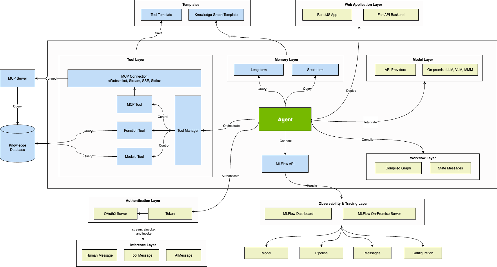

`Vinagent` is a simple and flexible library designed for building smart agent assistants across various industries. Vinagent towards the AI in multiple-industries like Financial and Banking, Healthcare, Manufacturing, and Autonomous Systems. It is designed based on simplicity, integrability, observability, and optimizablity. Vinagent features a clean syntax, supports individual customization, enhances capabilities through integration with multiple tools, and effectively handles complex tasks through curated workflow creation.

Whether you're creating an AI-powered deep search smart assistant, a financial analysis agent, or any domain-specific automation agent, Vinagent provides a simple yet powerful foundation.

With its modular tool system, you can easily extend your agent's capabilities by integrating a wide range of tools. Each tool is self-contained, well-documented, and can be registered dynamically—making it effortless to scale and adapt your agent to new tasks or environments.

## Feature comparison
<table style="width: 100%;">
    <tr>
      <th align="center">Feature</th>
      <th align="center">Vinagent</th>
      <th align="center">Dify.AI</th>
      <th align="center">LangChain</th>
      <th align="center">Flowise</th>
      <th align="center">OpenAI Assistants API</th>
    </tr>
    <tr>
      <td align="center">Programming Approach</td>
      <td align="center">Python Code</td>
      <td align="center">API + App-oriented</td>
      <td align="center">Python Code</td>
      <td align="center">App-oriented</td>
      <td align="center">API-oriented</td>
    </tr>
    <tr>
      <td align="center">Supported LLMs</td>
      <td align="center">Rich Variety</td>
      <td align="center">Rich Variety</td>
      <td align="center">Rich Variety</td>
      <td align="center">Rich Variety</td>
      <td align="center">OpenAI-only</td>
    </tr>
    <tr>
      <td align="center">Agent</td>
      <td align="center">✅</td>
      <td align="center">✅</td>
      <td align="center">✅</td>
      <td align="center">❌</td>
      <td align="center">✅</td>
    </tr>
    <tr>
      <td align="center">Workflow</td>
      <td align="center">✅</td>
      <td align="center">✅</td>
      <td align="center">❌</td>
      <td align="center">✅</td>
      <td align="center">❌</td>
    </tr>
    <tr>
        <td align="center">Graph Memory</td>
        <td align="center">✅</td>
        <td align="center">❌</td>
        <td align="center">❌</td>
        <td align="center">❌</td>
        <td align="center">❌</td>
    </tr>
    <tr>
        <td align="center">Personalize</td>
        <td align="center">✅</td>
        <td align="center">❌</td>
        <td align="center">❌</td>
        <td align="center">❌</td>
        <td align="center">❌</td>
    </tr>
    <tr>
        <td align="center">RAG Engine</td>
        <td align="center">✅</td>
        <td align="center">✅</td>
        <td align="center">✅</td>
        <td align="center">✅</td>
        <td align="center">✅</td>
    </tr>
    <tr>
        <td align="center">MCP Connection</td>
        <td align="center">✅</td>
        <td align="center">✅</td>
        <td align="center">✅</td>
        <td align="center">✅</td>
        <td align="center">✅</td>
      </tr>
    <tr>
      <td align="center">Observability</td>
      <td align="center">✅</td>
      <td align="center">✅</td>
      <td align="center">✅</td>
      <td align="center">❌</td>
      <td align="center">❌</td>
    </tr>
    <tr>
      <td align="center">Local Deployment</td>
      <td align="center">✅</td>
      <td align="center">✅</td>
      <td align="center">✅</td>
      <td align="center">✅</td>
      <td align="center">❌</td>
    </tr>
  </table>

## Component Overview

`Vinagent` helps design AI agents to solve various tasks across multiple domains such as Finance and Banking, Healthcare, Manufacturing, and Autonomous Systems. It provides a comprehensive set of components for building agents, including: Model, Tool, Graph Memory, Workflow, and Observability.

The following are specifically designed components:

- **Tools**: Supports a variety of different tools, from user-implemented tools like Function tool and Module tool, to tools from the MCP market. Thus, Vinagent ensures you always have all the necessary features and data for every task.

- **Memory**: Vinagent organizes the short-term and long-term memory of the Agent through graph storage, creating a graph network that compresses information more efficiently than traditional conversation history storage. This innovative approach helps Vinagent save memory and minimize hallucination.

- **Planning and Control**: Based on the graph foundation of Langgraph, Vinagent designs workflows with simpler syntax, using the right shift `>>` operator, which is easy to use for beginers. This makes creating and managing complex workflows much simpler compared to other agent workflow libraries, even for a complex conditional and parallel workflows.

- **Personalize user Experience**: Vinagent supports inference through three methods: asynchronous, synchronous, and streaming. This flexibility allows you to speed up processing and improve user experience when applying agents in AI products that require fast and immediate processing speeds.

- **Security**: Vinagent ensures AI Agent security through OAuth 2.0 authentication, a protocol that allows third-party applications to access Agent resources without exposing any user's credentials. This approach uses access token instread of direct user/password authentication. It works by orchestrating these participants.

- **Prompt Optimization**: Vinagent integrates automatic prompt optimization features, enhancing accuracy for Agents. This ensures the Agent operates effectively even with specialized tasks.
Observability: Allows monitoring of the Agent’s processing information on-premise and is compatible with Jupyter Notebook. You can measure total processing time, the number of input/output tokens, as well as LLM model information at each step in the workflow. This detailed observability feature is crucial for debugging and optimizing the Agent.

## Vinagent ecosystem

Although `Vinagent` can stand as a independent library for agent, it is designed to be integrated with other Vinagent's Ecosystem libraries that expands its capabilities rather than just a simple Agent. The `Vinagent` ecosystem consists of the following components:

- [Aucodb](https://github.com/datascienceworld-kan/AucoDB.git): An open-source database for storing and managing data for AI Agent, providing a flexible solution for storing and retrieving data for Vinagent's agents under multiple format such as collection of tools, messages, graph, vector storage, and logging. Aucodb can ingest and transform various text data into knowledge graph and save to neo4j and adapt various popular vector store databases like `chroma, faiss, milvus, pgvector, pinecone, qdrant, and weaviate`.

- [Mlflow - Extension](https://github.com/datascienceworld-kan/vinagent/tree/main#10-agent-observability): Intergate with mlflow library to log the Agent's information and profile the Agent's performance. This allows you to track the Agent capability and optimize.
